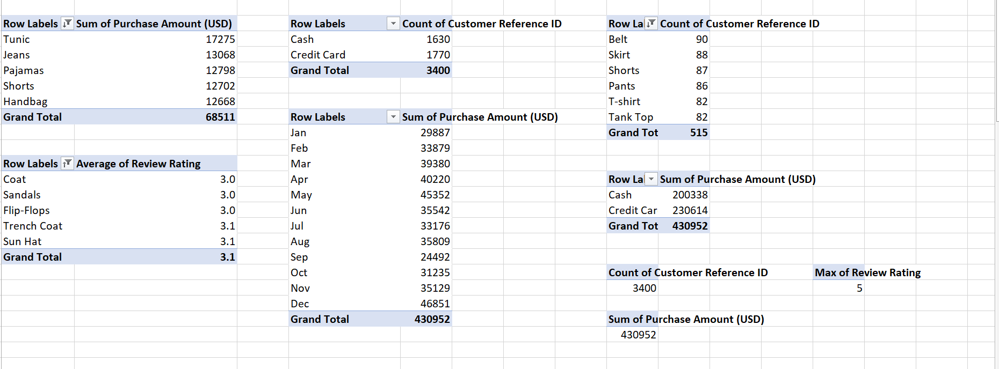

## Fashion-Retail-Sales-Analysis

### Introduction
The "fashion retail sales" is a comphrensive collection of data representing sales transactions from a clothing store.

### Objective
The primary objective of this project is to analyze the fashion retail sales dataset to gain insights into customer purchasing behaviour, payment preferences, and overall sales trends. This analysis aims to provide actionable recommendations to improve inventory management, customer satisfaction, and business performance.

### Data Sources
The dataset was obtained from kaggle. It has 3400 rows and 6 columns, it contains information about customer reference ID, Item purchased, purchase amount(USD), date of purchase, review rating and payment method.

### Tool
Excel- for analysis and visualization

### Data cleaning/preparation
1. Data loading/inspection
2. Handled missing values
Cleaning was done using excel power query to fill in zeros where there are blank spaces in the numeric columns.

### Exploratory Data Analysis
1. What are the high valued purchased items by customers?
2. What is the distribution of payment?
3. What is the most frequently purchased items by customers?
4. what is the average review rating by items puchased?
5. What is the highest review rating?
6. What is the total purchase amount?
7. what are the trends in purchases overtime?
8. How do different payment methods affect purchase amounts?
9. Hom many customers patronized the store?

### Data Analysis
pivot table was used to analyze and answer the above questions

